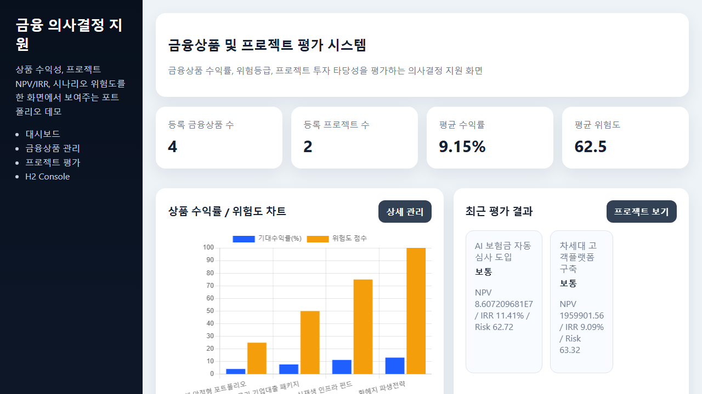
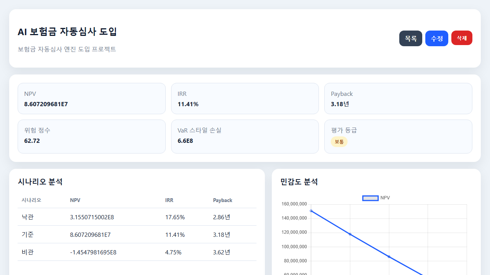
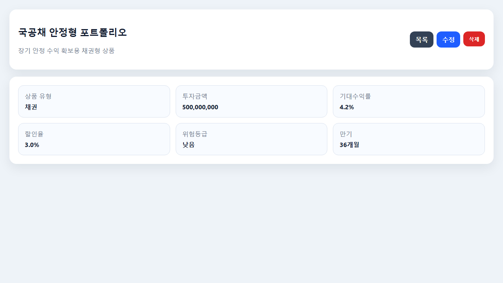

# 금융상품 및 프로젝트 평가 시스템

금융상품과 투자 프로젝트를 **수익성 + 위험도** 관점에서 함께 평가하는 Spring Boot 포트폴리오 프로젝트입니다.

## 한 줄 소개
**금융상품 비교 + 프로젝트 투자 타당성 평가 + 평가 이력 관리**를 하나의 대시보드와 REST API로 제공하는 의사결정 지원 포트폴리오입니다.

## 왜 이 프로젝트를 만들었는가
실무/포트폴리오 관점에서 금융 도메인 프로젝트는 단순 CRUD보다,
- 기대수익률과 위험도를 함께 해석하고
- 프로젝트별 현금흐름 기반 투자 타당성을 계산하며
- 평가 결과를 누적해 비교할 수 있어야
더 설득력이 있다고 봤습니다.

그래서 이 프로젝트는 단순 입력/조회 앱이 아니라,
**금융 의사결정에 필요한 계산, 비교, 이력화, 시각화**를 한 흐름으로 보여주는 데 초점을 맞췄습니다.

## 핵심 기능
- 대시보드: 등록 상품/프로젝트 수, 평균 수익률, 평균 위험도, 최근 평가 결과, 상품 차트, 프로젝트 비교 차트
- 금융상품 관리: 채권/대출/펀드/파생상품 CRUD
- 프로젝트 평가: 현금흐름 입력, NPV / IRR / Payback Period 계산
- 위험 분석: 낙관/기준/비관 시나리오, 할인율 민감도 분석, VaR 스타일 손실 추정
- 평가 스냅샷 이력: 프로젝트 평가 시 최근 10건 이력 저장 및 상세 화면/REST API 조회
- REST API: `/api/dashboard`, `/api/products`, `/api/projects`, `/api/projects/{id}/evaluation`, `/api/projects/{id}/history`
- 응답 DTO 정리: 프로젝트 목록/상세/평가이력 API를 엔티티 직접 노출 대신 응답 전용 DTO로 정제
- H2 기반 샘플 데이터 자동 로딩
- 계산 로직 + API 응답 테스트 + Spring Boot 통합 테스트 포함

## 포트폴리오에서 강조할 포인트
- **금융 도메인 계산 로직 직접 구현**
  - NPV, IRR, Payback Period, 시나리오 분석, 민감도 분석
- **단순 계산기에서 끝나지 않음**
  - 최근 평가 이력 저장
  - 프로젝트별 비교 차트
  - 대시보드 요약 지표 제공
- **REST API 품질 보강**
  - 입력 검증 강화
  - 일관된 예외 응답
  - DTO 기반 응답 정리
- **화면 + API + 테스트가 연결된 구조**
  - Thymeleaf UI
  - REST API
  - Service/Controller 테스트

## 기술 스택
- Java 17
- Spring Boot
- Spring MVC + Thymeleaf
- Spring Data JPA
- H2 Database
- Chart.js
- Gradle Wrapper

## 설계 의도
단순한 CRUD가 아니라, 금융상품 속성(기대수익률/할인율/위험등급/변동성)과 프로젝트 투자 타당성(NPV/IRR/Payback)을 함께 보여줘 **금융 도메인 이해**를 드러내는 포트폴리오로 구성했습니다.

## 도메인 구조
- `FinancialProduct`: 금융상품 마스터
- `EvaluationProject`: 프로젝트 기본 정보
- `ProjectCashFlow`: 프로젝트 연차별 현금흐름
- `ProjectEvaluationSnapshot`: 프로젝트 평가 스냅샷 이력
- `FinancialCalculationEngine`: 계산 전용 엔진
- `DashboardService`: 요약 지표/차트 데이터 조합
- `ProjectEvaluationService`: 프로젝트 CRUD + 평가 응답 생성 + 스냅샷 저장

## 사용자 시나리오
### 1) 금융상품 비교
사용자는 상품을 등록하고,
- 기대수익률
- 위험등급
- 투자금액
- 만기
를 기준으로 상품 포트폴리오를 비교할 수 있습니다.

### 2) 프로젝트 투자 타당성 평가
사용자는 프로젝트 기본 정보와 연차별 현금흐름을 입력하고,
- NPV
- IRR
- Payback Period
- 위험 점수
- VaR 스타일 손실
을 확인할 수 있습니다.

### 3) 분석 결과 누적 관리
프로젝트 평가를 반복 수행하면 결과가 스냅샷으로 저장되어,
- 최근 평가 이력
- 프로젝트별 비교
- 대시보드 시각화
로 이어집니다.

## 계산 공식과 가정
### 1. NPV
`NPV = -InitialInvestment + Σ(CFt / (1+r)^t)`
- `r`은 할인율(%)
- `CFt`는 t년차 순현금흐름(유입 - 유출)

### 2. IRR
- Newton-Raphson 방식으로 직접 구현
- NPV가 0이 되는 할인율을 반복 계산
- 결과는 % 단위로 반환

### 3. Payback Period
- 누적 순현금흐름이 초기투자금을 회수하는 시점을 계산
- 중간연도 회수는 비율로 보간하여 소수점 연차로 반환

### 4. 시나리오 분석
- 낙관: 현금흐름 +15%, 할인율 -1%p
- 기준: 입력값 그대로
- 비관: 현금흐름 -15%, 할인율 +1.5%p

### 5. 민감도 분석
- 할인율을 기준값에서 -2%p ~ +2%p 변화시켜 NPV 변동 관찰

### 6. 위험 점수 / VaR 스타일 지표
- 위험 점수: 할인율 대비 IRR 스프레드, 회수기간, 현금흐름 변동성을 합성한 단순 포트폴리오용 점수
- VaR 스타일 손실: `투자금액 × 변동성 × 1.65(95% z-score)`

## 실행 방법
```bash
# Windows
.\gradlew.bat bootRun
```
실행 후 접속:
- 메인 화면: <http://localhost:8082>
- H2 Console: <http://localhost:8082/h2-console>
  - JDBC URL: `jdbc:h2:mem:finance`
  - username: `sa`
  - password: (빈값)

## 주요 화면
1. **대시보드**
   - 상품 수익률/위험도 차트
   - 프로젝트 NPV / 위험도 비교 차트
   - 최근 프로젝트 평가 결과 요약
   - 최근 스냅샷 기준 상위 프로젝트 비교 요약
2. **금융상품 관리**
   - 상품 등록/수정/삭제/상세 조회
3. **프로젝트 평가**
   - 현금흐름 입력
   - NPV/IRR/Payback/위험등급/시나리오/민감도 차트 확인
   - 최근 평가 스냅샷 이력 조회

## 실행 화면
### 1) 대시보드


### 2) 프로젝트 평가 상세


### 3) 금융상품 상세


## REST API 예시
- `GET /api/dashboard`
- `GET /api/products`
- `POST /api/products`
- `GET /api/projects`
- `POST /api/projects`
- `GET /api/projects/{id}/evaluation`
- `GET /api/projects/{id}/history`

### `GET /api/dashboard` 응답 예시
```json
{
  "totalProducts": 4,
  "totalProjects": 3,
  "averageReturnRate": 7.42,
  "averageRiskScore": 51.2,
  "productNames": ["국공채 안정형", "성장형 펀드"],
  "productReturns": [4.2, 9.8],
  "productRiskScores": [25.0, 75.0],
  "projectComparisons": [
    {
      "projectId": 1,
      "projectName": "디지털 보험 플랫폼",
      "npv": 12500000.12,
      "irr": 13.4,
      "riskScore": 34.2,
      "grade": "EXCELLENT"
    }
  ]
}
```

### `GET /api/projects/{id}/history` 응답 예시
```json
[
  {
    "id": 10,
    "projectId": 1,
    "projectName": "디지털 보험 플랫폼",
    "npv": 12500000.12,
    "irr": 13.4,
    "paybackPeriod": 2.8,
    "riskScore": 34.2,
    "varEstimate": 9900000.0,
    "grade": "EXCELLENT",
    "evaluatedAt": "2026-04-23T09:10:00"
  }
]
```

## 테스트
```bash
.\gradlew.bat test
```
포함 테스트:
- NPV 계산
- IRR 계산
- Payback Period 계산
- 시나리오/민감도 분석 개수
- 평가 등급 판정
- 프로젝트 입력 검증(종료일 역전, 현금흐름 누락, 연차 중복)
- API 예외 응답 포맷(검증 실패 / 리소스 미존재)
- 평가 스냅샷 저장 및 최근 이력 조회 서비스 테스트
- 프로젝트 목록/상세/이력 API 응답 DTO 구조 테스트
- 대시보드 API 응답 구조 테스트
- 샘플 데이터 기반 대시보드/평가/이력 흐름 통합 테스트

## API 품질 보강
- 프로젝트 생성/수정 시 입력값 검증 강화
  - 종료일이 시작일보다 빠를 수 없음
  - 최소 1건 이상의 현금흐름 필요
  - 현금흐름 연차 중복 금지
- REST API 예외 응답 표준화
  - `VALIDATION_FAILED`
  - `RESOURCE_NOT_FOUND`
- 프로젝트 API 응답 DTO 정리
  - 목록: `ProjectSummaryResponse`
  - 상세: `ProjectDetailResponse`
  - 평가 이력: `ProjectEvaluationSnapshotResponse`
- 잘못된 입력이나 없는 프로젝트 조회 시 일관된 JSON 오류 응답 제공

## 테스트 전략
- **계산 엔진 단위 테스트**: NPV, IRR, Payback, 시나리오, 민감도 분석 검증
- **검증/예외 테스트**: 잘못된 프로젝트 요청과 표준 예외 응답 포맷 검증
- **API 응답 테스트**: 프로젝트/대시보드 응답 DTO 구조 검증
- **통합 테스트**: 샘플 데이터로 대시보드 조회 → 프로젝트 평가 → 평가 이력 조회 흐름 검증

## 제출용으로 보면 아쉬운 점
- 인증/권한 관리까지 포함한 운영형 구조는 아직 아님
- Monte Carlo 기반 정교한 리스크 모델은 미구현
- PDF 리포트/엑셀 내보내기 기능은 아직 없음
- 현재는 H2 메모리 DB 기준 데모 구성

## 향후 개선 아이디어
- Monte Carlo 시뮬레이션 기반 위험 분석
- 사용자별 권한 관리
- PostgreSQL 전환 및 이력 테이블 분리
- PDF 평가 리포트 출력
