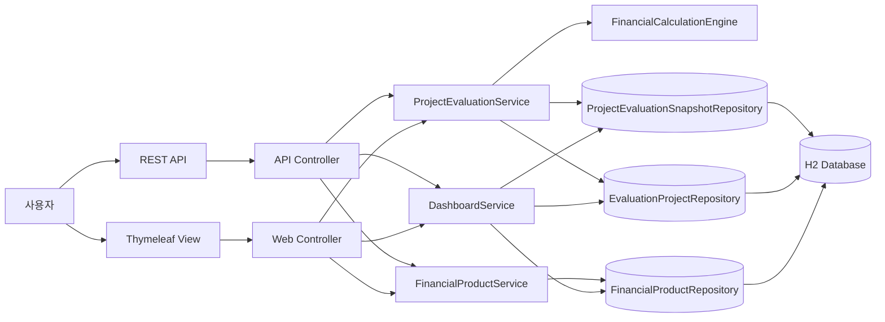
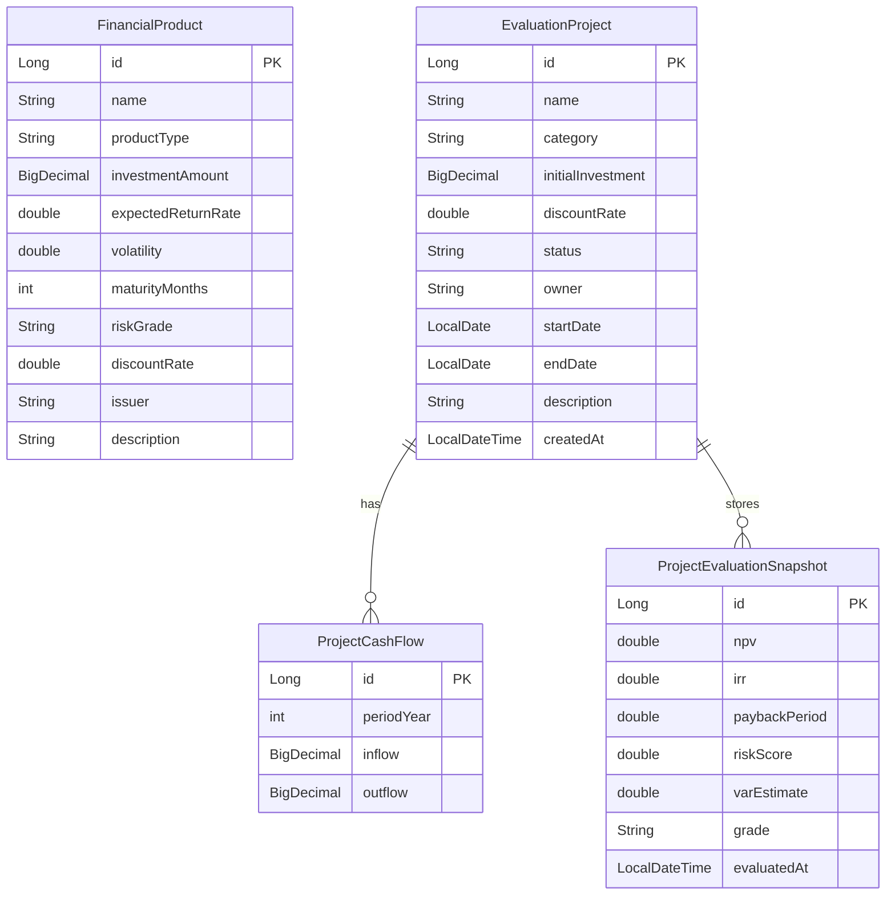

# 아키텍처 / ERD

## 시스템 구성

## 도메인 ERD

## 평가 흐름
1. 사용자가 프로젝트와 현금흐름을 등록한다.
2. `ProjectEvaluationService`가 프로젝트 데이터를 조회한다.
3. `FinancialCalculationEngine`가 NPV / IRR / Payback / Risk Score / VaR 스타일 손실을 계산한다.
4. 계산 결과를 `ProjectEvaluationSnapshot`으로 저장한다.
5. 대시보드와 상세 화면, REST API가 최신 결과와 최근 이력을 함께 노출한다.

## 포트폴리오 관점 핵심
- View + API + Service + Repository 레이어가 분리되어 있다.
- 계산 로직(`FinancialCalculationEngine`)이 웹 레이어와 분리되어 테스트 가능하다.
- 프로젝트 평가 결과를 단발성 계산으로 끝내지 않고 스냅샷 이력으로 누적한다.
- 화면, API, 테스트, 문서가 하나의 흐름으로 연결되어 있다.
